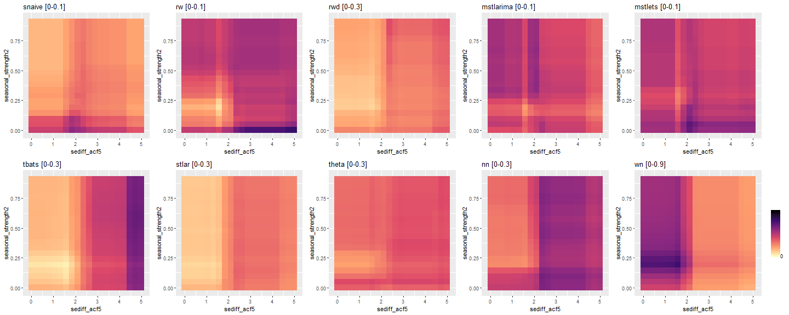

## About me

```{r, comment=NA, echo=FALSE}
knitr::include_url("https://thiyanga.netlify.app/")
```

Web: https://thiyanga.netlify.com/

---

background-image: url(img/jhu.png)
background-size: contain

```{r setup, include=FALSE}
options(htmltools.dir.version = FALSE)
```

---
class: inverse, center, middle
background-image: url(img/jhu.png)
background-position: 50% 60%1

background-size: contain


`r anicon::nia("Let's visualize the coronavirus pandemic!",  size=3, colour="yellow", animate="pulse")`

---
background-image: url(img/coronavirus.png)
background-size: 90px
background-position: 100% 6%

# Data: coronavirus package


```r
install.packages("coronavirus")
# devtools::install_github("RamiKrispin/coronavirus")
```


```{r, comment=NA}
library(coronavirus)
head(coronavirus, 8)
```


---

```{r, echo=FALSE, message=FALSE, warning=FALSE, comment=NA}
library(tidyverse)


coronavirus <- coronavirus %>% mutate(cases = replace(cases, which(cases<0), NA))
coronavirus <- coronavirus %>% mutate(cases = replace(cases, which(cases>800000), 800))
#confirmed <- coronavirus %>% filter(type == "confirmed")
confirmed <- coronavirus %>% 
  filter(type == "confirmed") %>%
  group_by(country, date) %>%
  summarise(cases = sum(cases)) 
```

```{r, echo=FALSE, fig.width=15, fig.height=8, warning=FALSE, message=FALSE}
library(plotly)
p <- ggplot(confirmed, aes(x=date, y=cases, col=country)) + geom_line() + ggtitle("Confirmed Cases") + theme(legend.position = "none") 


ggplotly(p)
```

---

```{r, echo=FALSE, fig.width=15, fig.height=8, warning=FALSE, message=FALSE}
library(plotly)
#p <- ggplot(confirmed, aes(x=date, y=cases, col=country)) + geom_line() + ggtitle("Confirmed Cases") + theme(legend.position = "none") 
p <- ggplot(confirmed, aes(x=date, y=cases, col=country)) + geom_line() + ggtitle("Confirmed Cases") + geom_line(data = subset(confirmed,  country == "Norway"),color = "black", label="Norway") + theme(legend.position = "none") 
p
```


---


```{r, echo=FALSE, fig.width=15, fig.height=8, warning=FALSE, message=FALSE}
library(plotly)
#p <- ggplot(confirmed, aes(x=date, y=cases, col=country)) + geom_line() + ggtitle("Confirmed Cases") + theme(legend.position = "none") 
p <- ggplot(confirmed, aes(x=date, y=cases, col=country)) + geom_line() + ggtitle("Confirmed Cases") + geom_line(data = subset(confirmed,  country == "Norway"),color = "black", label="Norway") + theme(legend.position = "none") + ylim(c(0, 800))
p
```

---

class: split-70 hide-slide-number
background-image: url("img/jhu.png")
background-size: cover

.column.slide-in-left[
.sliderbox.vmiddle.shade_main.center[
.font5[Time Series Features]]]
.column[
]


---

# Time series features

Transform a given time series $y=\{y_1, y_2, \cdots, y_n\}$ to a feature vector $F = (f_1(y), f_2(y), \cdots, f_p(y))'$. 


## Examples of time series features

- strength of trend

- strength of seasonality

- lag-1 autocorrelation

- spectral entropy

- proportion of zeros

More information: 

Talagala, T. S., Hyndman, R. J., & Athanasopoulos, G. (2018). Meta-learning how to forecast time series. Monash Econometrics and Business Statistics Working Papers, 6, 18.

---


class: split-two white

.column.bg-main1[.content.vmiddle.center[

## Time-domain representation

```{r, comment=NA, message=FALSE, warning=FALSE, echo=FALSE}
library(Mcomp)
library(ggplot2)
library(grid)
library(gridExtra)
library(ggrepel)
library(png)
library(tsfeatures)
library(tidyverse)
library(ggpubr)
# Extract required series
series_id <- c("N0001", "N0633", "N0625", "N0645","N1912", "N2012")
color = c("#1b9e77", "#d95f02", "#7570b3", "#e7298a", "#66a61e", "#e6ab02")
six_series <- lapply(M3[series_id], function(u){u$x})
p <- lapply(six_series,
function(u) {autoplot(u) + xlab("") + ylab("")}
)
for (i in seq_along(six_series))
p[[i]] <- p[[i]] +geom_line(color=color[i]) +ggtitle(series_id[i])+theme(title =element_text(size=10, face='bold'))
grid.arrange(grobs = p, ncol = 2)
```

]]

.column.bg-main2[.content.vmiddle.center[

## Feature-domain representation

```{r, comment=NA, message=FALSE, warning=FALSE, echo=FALSE}
df <- tsfeatures(six_series, c("stl_features")) %>%
  select(trend, seasonal_strength) %>%
  rename(seasonality = seasonal_strength) %>%
  replace_na(list(seasonality = 0))
df$id <- names(six_series)
ggplot(df, aes(x = trend, y = seasonality)) +
  geom_point(size = 5, color = c("#1b9e77", "#d95f02", "#7570b3", "#e7298a", "#66a61e", "#e6ab02")) +
  xlim(0, 1) + ylim(0, 1) +
  xlab("Strength of trend") + 
  ylab("Strength of seasonality") + 
  coord_fixed() +
  geom_text_repel(
    aes(label = id),
    colour = "black",
    size = 5,
    box.padding = unit(0.5, "lines")
  ) +
  theme(legend.position = "none")
```

]]


---


class: split-two white


.column.bg-white[.content[

```{r, comment=NA, message=FALSE, eval=FALSE}
library(tsibble)
norway <- confirmed %>% 
  filter(country == "Norway")


```

]]

.column.bg-white[.content[
]]

---

class: split-two white


.column.bg-white[.content[

```{r, comment=NA, message=FALSE, eval=FALSE}
library(tsibble)
norway <- confirmed %>% 
  filter(country == "Norway")
norway.tsibble <- tsibble( ##<<
  date = as.Date("2020-01-22") + 0:491, ##<<
  Observation = norway$cases, ##<<
  index = date) ##<<


```

]]

.column.bg-white[.content[
]]


---


class: split-two white


.column.bg-white[.content[

```{r, comment=NA, message=FALSE, eval=FALSE}
library(tsibble)
norway <- confirmed %>% 
  filter(country == "Norway")
norway.tsibble <- tsibble( 
  date = as.Date("2020-01-22") + 0:491, 
  Observation = norway$cases, 
  index = date) 
norway.tsibble ##<<


```

```{r, comment=NA, message=FALSE, echo=FALSE}
library(tsibble)
norway <- confirmed %>% 
  filter(country == "Norway")
norway.tsibble <- tsibble( 
  date = as.Date("2020-01-22") + 0:491, 
  Observation = norway$cases, 
  index = date) 
norway.tsibble 


```

]]

.column.bg-white[.content[
]]


---


class: split-two white


.column.bg-white[.content[

```{r, comment=NA, message=FALSE}
library(tsibble)
norway <- confirmed %>% 
  filter(country == "Norway")
norway.tsibble <- tsibble( 
  date = as.Date("2020-01-22") + 0:491, 
  Observation = norway$cases, 
  index = date) 
norway.tsibble 


```

]]

.column.bg-white[.content[

```{r, comment=NA, message=FALSE}
library(fable) ##<<
autoplot(norway.tsibble) ##<<
```

]]


---

## Compute features

```{r, comment=NA, message=FALSE}
library(feasts) ##<<
norway.tsibble %>% ##<<
  features(Observation, feature_set(tags = ##<<
  c("decomposition", "intermittent", "autocorrelation"))) %>% as.data.frame()##<<
```


---


.pull-left[

## tibble

```{r, comment=NA}
confirmed 

```

]

.pull-right[

## tsibble

```{r, comment=NA}
confirmed.tsibble <- confirmed %>%
  as_tsibble(index = date, key = country)
confirmed.tsibble
```

]

---

## Features for all countries

```{r, comment=NA, message=FALSE, warning=FALSE}
features.all <- confirmed.tsibble %>% features(cases, feature_set(tags = c("decomposition", "intermittent", "autocorrelation")))
features.all
```

---
class: split-two white


.column.bg-white[.content[

# Feature-based visualization

```{r, comment=NA, message=FALSE, warning=FALSE, eval=FALSE}
features.all %>%
  ggplot(aes(x = trend_strength, y =  seasonal_strength_week)) + 
  geom_point() + 
  coord_equal() + 
  xlim(c(0,1)) + ylim(c(0,1)) + 
  labs(x = "Trend strength",
       y = "Seasonal strength") + 
  theme(legend.position = "bottom")
```

]]

.column.bg-white[.content[

#

```{r, comment=NA, message=FALSE, warning=FALSE, echo=FALSE}
p <- features.all %>%
  ggplot(aes(y = trend_strength, x = seasonal_strength_week)) + 
  geom_point() + 
  coord_equal() + 
  xlim(c(0,1)) + ylim(c(0,1)) + 
  labs(y = "Trend strength", x = "Seasonal strength") + 
  theme(legend.position = "none") 
ggplotly(p)
```

]]


---


.pull-left[

# Time-domain 

```{r, comment=NA, message=FALSE, warning=FALSE, echo=FALSE}
df2 <- confirmed %>% filter(country=="US")
p1 <- autoplot(as.ts(df2$cases, frequency=c(7)), col="#1b9e77") + ggtitle("US") + ylab("")
df3 <- confirmed %>% filter(country=="Norway")
p2 <- autoplot(as.ts(df3$cases, frequency=c(7)), col="#d95f02") + ggtitle("Norway") + ylab("")
df4 <- confirmed %>% filter(country=="India")
p3 <- autoplot(as.ts(df4$cases, frequency=c(7)), col="#7570b3") + ggtitle("India") + ylab("")
df5 <- confirmed %>% filter(country=="China")
p4 <- autoplot(as.ts(df5$cases, frequency=c(7)), col="#e7298a") + ggtitle("China") + ylab("")
library(patchwork)
p1/p2/p3/p4
```


]


.pull-right[

# Feature-space

```{r, comment=NA, message=FALSE, warning=FALSE, echo=FALSE}
df2 <- features.all %>% filter(country=="US")
df3 <- features.all %>% filter(country=="Norway")
df4 <- features.all %>% filter(country=="India")
df5 <- features.all %>% filter(country=="China")

p <- features.all %>%
  ggplot(aes(y = trend_strength, x = seasonal_strength_week, label=country)) + 
  geom_point() + 
  coord_equal() + 
  xlim(c(0,1)) + ylim(c(0,1)) + 
  labs(y = "Trend strength", y = "Seasonal strength") + 
  theme(legend.position = "none") + 
    geom_point(data=df2, aes(y = trend_strength, x = seasonal_strength_week), 
             colour="#1b9e77", 
             size=5) +
  geom_point(data=df3, aes(y = trend_strength, x = seasonal_strength_week), 
             colour="#d95f02", 
             size=5) +
  geom_point(data=df4, aes(y = trend_strength, x = seasonal_strength_week), 
             colour="#7570b3", 
             size=5) +
  geom_point(data=df5, aes(y = trend_strength, x = seasonal_strength_week), 
             colour="#e7298a", 
             size=5) 
ggplotly(p)

```

]


---

class: split-70 hide-slide-number
background-image: url("img/ts.jpeg")
background-size: cover

.column.slide-in-left[
.sliderbox.vmiddle.shade_main.center[
.font5[Large-scale Forecasting]]]
.column[
]


---
class: inverse, center, middle
background-image: url(img/rice1.png)
background-size: contain

# Big picture

---

class: inverse, center, middle
background-image: url(img/rice2.png)
background-size: contain

# Big picture


---
class: inverse, center, middle
background-image: url(img/f1.png)
background-size: contain


---
class: inverse, center, middle
background-image: url(img/f2.png)
background-size: contain

---
class: inverse, center, middle
background-image: url(img/f3.png)
background-size: contain

---
class: inverse, center, middle
background-image: url(img/f4.png)
background-size: contain

---
class: inverse, center, middle
background-image: url(img/f5.png)
background-size: contain

---
class: inverse, center, middle
background-image: url(img/f6.png)
background-size: contain

---
class: inverse, center, middle
background-image: url(img/f7.png)
background-size: contain


---
class: inverse, center, middle
background-image: url(img/f8.png)
background-size: contain

---
class: inverse, center, middle
background-image: url(img/f9.png)
background-size: contain

---
class: inverse, center, middle
background-image: url(img/f10.png)
background-size: contain


---
class: inverse, center, middle
background-image: url(img/f11.png)
background-size: contain

---
class: inverse, center, middle
background-image: url(img/f12.png)
background-size: contain

---
class: inverse, center, middle
background-image: url(img/f13.png)
background-size: contain

---
## FFORMS: Feature-based FORecast Model Selection

```{r   out.width = "20%", echo = FALSE, fig.cap=''}
knitr::include_graphics("img/seer.png")
```


```{r, comment=NA, eval=FALSE}
install.packages("seer")
#devtools::install_github("thiyangt/seer")
library(seer)
```


---

# Example dataset

```r
library(Mcomp)
yearlym1 <- subset(M1, "yearly")
yearlym1
```


```{r echo=FALSE, message=FALSE, warning=FALSE, comment=NA, size='tiny'}
library(Mcomp)
yearlym1 <- subset(M1, "yearly")
yearlym1
```


---

## Input: features

```r
library(seer)
cal_features(yearlym1[1:2], database="M1",
h=6, highfreq=FALSE)

```

```{r echo=FALSE, message=FALSE, warning=FALSE, comment=NA, size='tiny'}
library(seer)
seer::cal_features(yearlym1[1:2], database="M1", h=6, highfreq=FALSE) 
```

---

## Output: class labels

```r 
seer::fcast_accuracy(tslist=yearlym1[1:2], 
               models= c("arima","ets","rw", "theta", "nn"), 
               database ="M1", cal_MASE, h=6, 
               length_out = 1, 
               fcast_save = TRUE)
```

```{r echo=FALSE, message=FALSE, warning=FALSE, comment=NA, size='tiny'}
seer::fcast_accuracy(tslist=yearlym1[1:2], 
               models= c("arima","ets","rw","theta", "nn"), 
               database ="M1", cal_MASE, h=6, 
               length_out = 1, 
               fcast_save = TRUE)
```

---

## Training set

```r
prepare_trainingset(accuracy_set = accuracy_m1, 
feature_set = features_m1)$trainingset
```

```{r echo=FALSE, message=FALSE, warning=FALSE, comment=NA, size='tiny'}
data(M1)
yearly_m1 <- subset(M1, "yearly")
accuracy_m1 <- fcast_accuracy(tslist=yearly_m1[1:2], models= c("arima","ets","rw","rwd", "theta", "nn"), database ="M1", cal_MASE, h=6, length_out = 1, fcast_save = TRUE)
features_m1 <- cal_features(yearly_m1[1:2], database="M1", h=6, highfreq = FALSE)

# prepare training set
prepare_trainingset(accuracy_set = accuracy_m1, feature_set = features_m1)$trainingset
```

---

## FFORMS classifier

```r
rf <- build_rf(training_set = training_set, 
                testset= M3yearly_features,  
                rf_type="ru", ntree=100, seed=1, 
               import=FALSE, mtry = 8)
```


```{r echo=FALSE, message=FALSE, warning=FALSE, comment=NA, size='tiny', comment=NA}
# steps 3 and 4 applied to yearly series of M1 competition
data(M1)
yearly_m1 <- subset(M1, "yearly")
accuracy_m1 <- fcast_accuracy(tslist=yearly_m1, models= c("arima","ets","rw","rwd", "theta", "nn"), database ="M1", cal_MASE, h=6, length_out = 1, fcast_save = TRUE)
features_m1 <- cal_features(yearly_m1, database="M1", h=6, highfreq = FALSE)
# prepare training set
prep_trainingset <- prepare_trainingset(accuracy_set = accuracy_m1, feature_set = features_m1)
training_set <- prep_trainingset$trainingset
yearly_m3 <- subset(M3, "yearly") # M3 dataset is used as a test set
M3yearly_features <- seer::cal_features(yearly_m3, database="M3", h=6, highfreq = FALSE)
rf <- build_rf(training_set = training_set, testset= M3yearly_features,  
               rf_type="ru", ntree=100, seed=1, 
               import=FALSE, mtry = 8)
```

```r
head(rf$predictions)
```

```{r, eval=TRUE, size='tiny', comment=NA}
head(rf$predictions)
```


---
class: inverse, center, middle
background-image: url(img/forest.jpg)
background-size: content

---

```{r   out.width = "100%", echo = FALSE, fig.cap=''}

```

Source: https://theblue.ai/blog/lime-models-explanation/

---

# explainer package

Machine learning interpretability tools (randomForest)

- Which features are the most important?

- Where are they important?

- How are they important?

- When and how are features linked with the prediction
outcome?

- When and how strongly do features interact with
other features?

```{r, eval=FALSE}
devtools::install_github("thiyangt/explainer")
library(explainer)

```

---
background-image: url(img/ice1.png)
background-size: contain

## Partial dependence plots and ICE curves


---
background-image: url(img/ice2.png)
background-size: contain

## Partial dependence plots and ICE curves

---

background-image: url(img/ice3.png)
background-size: contain

## Partial dependence plots and ICE curves

---
background-image: url(img/ice4.png)
background-size: contain

## Partial dependence plots and ICE curves

---
background-image: url(img/ice5.png)
background-size: contain

## Partial dependence plots and ICE curves


---

## Partial dependency plots for hourly data: entropy

-  forecastability of a time series

.pull-left[

```{r  echo = FALSE, fig.cap=''}
knitr::include_graphics("img/entropy.png")
```


]

.pull-right[

```{r  echo = FALSE, fig.cap=''}
knitr::include_graphics("img/en_pdp4.png")
```


]


---

# Interaction effect

Interaction between linearity and seasonal lag at
seasonally-differenced series


---

# Interaction effect

Interaction between linearity and seasonal lag at
seasonally-differenced series




---


class: middle center bg-main1


# Thank you

```{r   out.width = "20%", echo = FALSE, fig.cap=''}
knitr::include_graphics("img/seer.png")
```


```{r, echo=FALSE}
anicon::faa("twitter", animate="float", size=3, colour="lightblue")
```

```{r, echo=FALSE}
anicon::faa("github", animate="float", size=3, colour="yellow")
```

# @thiyangt

# Web: https://thiyanga.netlify.com/

